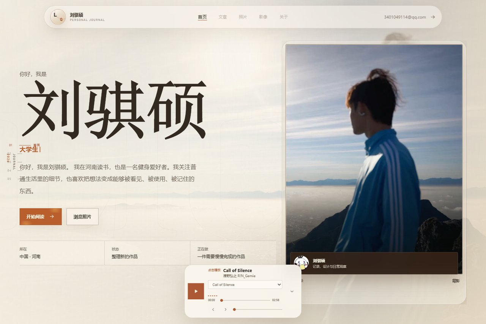
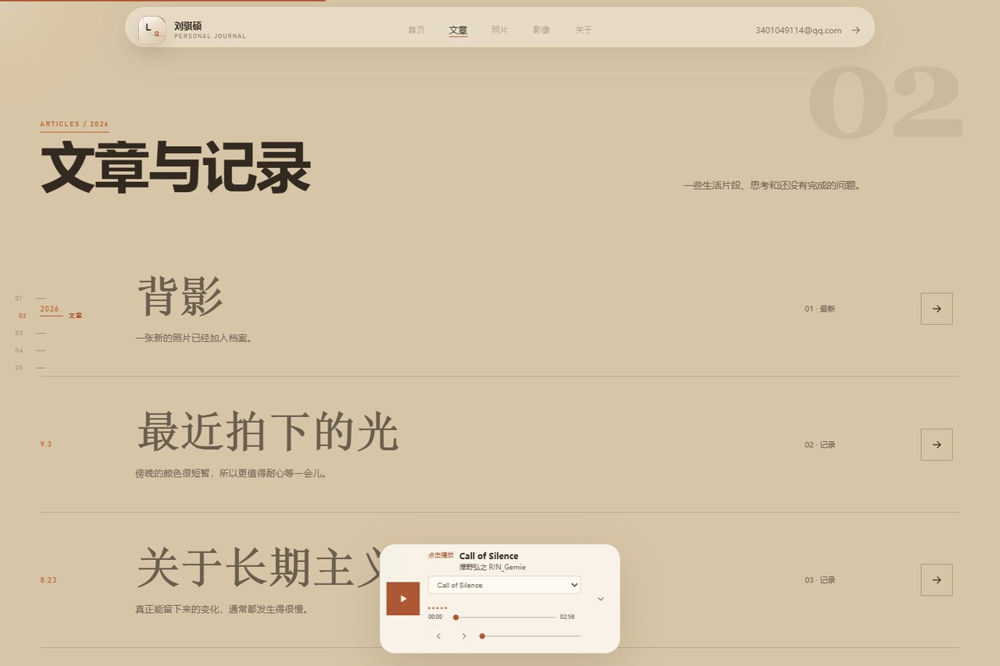
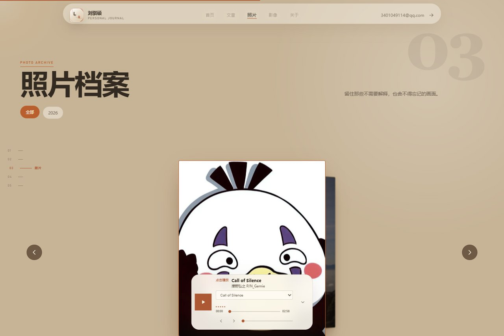
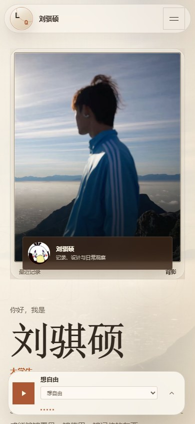

# 刘骐硕的个人博客


一个记录文章、照片、影像与日常生活的个人内容网站。项目采用原生 HTML、CSS 和 JavaScript 构建，并提供 Node.js 本地管理后台，用于维护网站内容、照片分组、文章和媒体资源。

[项目预览](#项目预览) · [架构文档](./ARCHITECTURE.md) · [部署文档](./DEPLOYMENT.md) · [设计规范](./docs/DESIGN-SYSTEM.md) · [常见问题](./docs/FAQ.md) · [贡献规范](./CONTRIBUTING.md) · [安全政策](./SECURITY.md) · [网站许可证](./license.html) · [许可证原文](./LICENSE)

## 项目预览

| 首页 | 文章与记录 |
|---|---|
|  |  |

| 照片档案 | 移动端 |
|---|---|
|  |  |

使用 `node server.cjs` 启动本地内容管理后台。

## 主要功能

- 响应式个人主页与沉浸式视觉布局
- 文章与文字记录展示
- 照片档案、照片分组和灯箱浏览
- 影像与媒体内容展示
- 背景音乐、随机播放与音乐可视化
- 滚动文字、页面揭示与交互动效
- 本地后台管理界面
- 网站内容 JSON 存储与同步
- 图片、音频、视频等本地资源上传
- 移动端、平板和桌面端适配

## 技术栈

- HTML5
- CSS3
- 原生 JavaScript
- Node.js 内置 HTTP 服务
- 本地 JSON 内容存储
- 无第三方前端框架
- 无第三方运行时依赖

## 项目结构

```text
llllKK/
├─ assets/              # 内容配置、图片、音频和其他静态资源
├─ components/          # 页面组件与代码片段
├─ functions/           # 接口与业务功能
├─ admin.html           # 后台管理页面
├─ admin.css            # 后台样式
├─ admin.js             # 后台交互与内容管理
├─ app.js               # 前台渲染、文章、照片与音乐功能
├─ index.html           # 网站首页
├─ index-v2.css         # 首页视觉版本
├─ index-v3.css         # 首页增强视觉版本
├─ styles.css           # 前台基础样式
├─ license.html         # 使用许可与版权声明
├─ license.css          # 许可证页面样式
├─ server.cjs           # 本地 Node.js 服务与管理接口
├─ start-admin.bat      # Windows 后台启动脚本
└─ LICENSE              # 刘骐硕 · 绊谈专有许可证
```

## 本地运行

需要安装 Node.js。项目只使用 Node.js 内置模块，不需要执行依赖安装。

```bash
node server.cjs
```

默认地址：

```text
后台管理：http://127.0.0.1:4175/admin.html
内容接口：http://127.0.0.1:4175/api/content
服务状态：http://127.0.0.1:4175/api/status
```

也可以在 Windows 中直接运行：

```text
start-admin.bat
```

指定其他端口：

```bash
node server.cjs 8080
```

## 管理密钥

可通过环境变量 `ADMIN_TOKEN` 设置后台管理密钥：

```powershell
$env:ADMIN_TOKEN="你的管理密钥"
node server.cjs
```

未设置 `ADMIN_TOKEN` 时，本地服务默认不要求管理密钥。公开部署时必须设置安全的密钥，不要将真实密钥提交到仓库。

## 内容存储

- `assets/content.json`：后台维护的网站内容数据
- `assets/content.js`：供前台读取的网站内容脚本
- 上传的图片、音频和视频保存在 `assets` 目录中
- API 请求体上限为 18 MB，单个上传文件上限为 12 MB

建议定期备份 `assets` 目录，避免内容或媒体资源意外丢失。

## 服务接口

| 方法 | 地址 | 用途 |
|---|---|---|
| `GET` | `/api/status` | 检查本地服务状态 |
| `POST` | `/api/auth` | 验证后台管理密钥 |
| `GET` | `/api/content` | 读取网站内容 |
| `POST` | `/api/content` | 保存网站内容 |
| `POST` | `/api/upload` | 上传图片、音频或视频 |

## 部署说明

`server.cjs` 默认仅监听 `127.0.0.1`，适合在个人电脑上运行管理后台。公开部署时应使用正式的 Web 服务器、HTTPS、访问控制、数据备份和更严格的上传文件校验。

## 许可证

本项目使用 **绊谈专有许可证（Bantan Proprietary License）**。

- 允许个人使用、学习参考和小范围分享
- 禁止商业使用、二次分发、公开发布和移除品牌标识
- 网站许可证页面：[license.html](./license.html)
- 具体权利义务以仓库根目录的 [LICENSE](./LICENSE) 为准

Copyright (c) 2026 Liu Qishuo · Bantan. All Rights Reserved.
